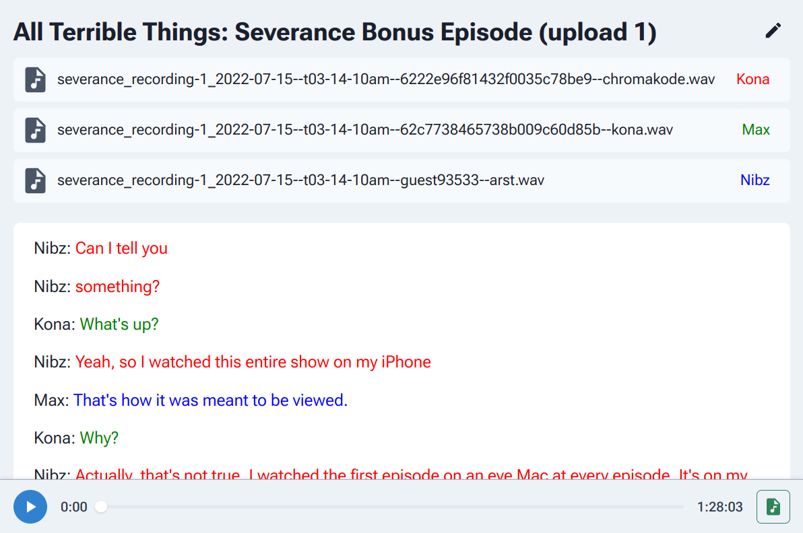

# Coalesce

Coalesce is an audio editor which makes slicing dialogue as easy as editing text.



---

## Project Status

🚧 Barebones Demo 🚧

Features:

- AI transcription using [whisper-timestamped](https://github.com/linto-ai/whisper-timestamped)
- Nondestructive text editing: remove and reorder spoken words as text
- Visually refine word timings with a waveform editor
- Export mixed down mono 48khz audio

Next up:

- [x] Lazy load audio data from chunks
- [x] Improve playback perf w/ incremental lookahead audio scheduler
- [ ] Highlight words as they're played
- [ ] Collaborative editing
- [ ] Export separate audio tracks
- [ ] Add sound clips

## How to use

1. Add your audio files (flac preferred) to `public/project/`. Give each file a short name.
2. Create a `public/project/project.json` file.

   Example:

   ```json
   {
     "tracks": {
       "kona": { "color": "green" },
       "max": { "color": "blue" },
       "nibz": { "color": "red" }
     }
   }
   ```

3. Split your audio into chunks:

   ```sh
   cd public/project/
   python ../../scripts/prepareAudio.py *.flac
   ```

4. Use [whisper-timestamped](https://github.com/linto-ai/whisper-timestamped) to transcribe your audio files. Example:

   ```sh
   docker run whisper_timestamped -v ~/path-to-audio-files/:/audio -it --entrypoint \
   whisper_timestamped --model small --vad True --accurate True --output_dir . --output_format json /audio/*
   ```

   Copy the output JSON files to `public/project/` and name each JSON file after the track.

   Your project directory should look like:

   ```sh
   $ ls public/project/
   kona.flac  kona.json  max.flac  max.json  nibz.flac  nibz.json  project.json
   ```

5. `npm install` and `npm start`
